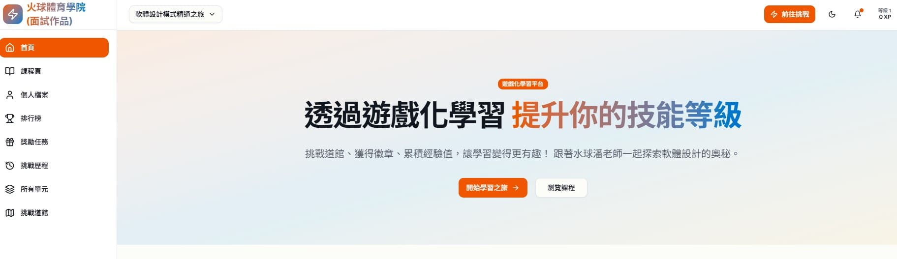
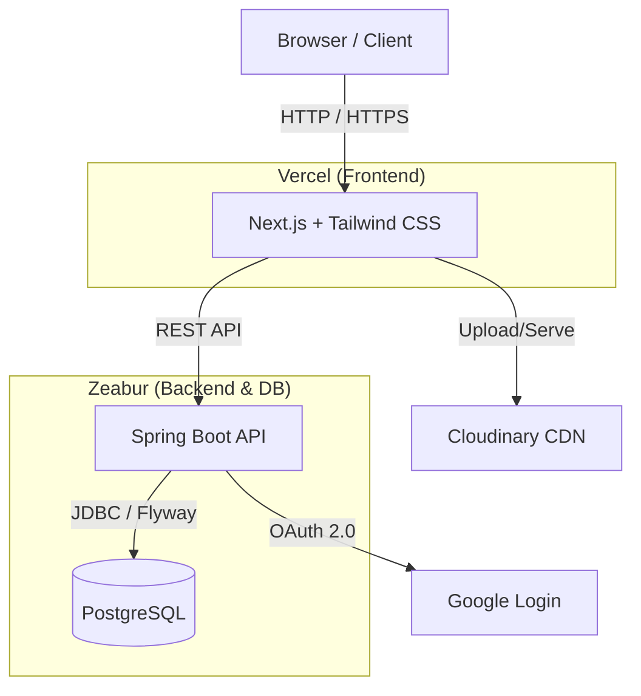

# Waterballsa 專案



這是一個前後端分離的全端應用系統，具備完整的身分驗證（Google OAuth + JWT）、資料庫遷移與整合 Docker 容器化部署環境。

## 🛠️ 技術棧 (Tech Stack)

### 🎨 前端 (Frontend)

- **核心框架**: Next.js 16 (React 19)
- **開發語言**: TypeScript
- **套件管理工具**: pnpm
- **樣式與 UI 庫**:
  - Tailwind CSS (v4)
  - Radix UI (無頭及高可及性 UI 元件)
  - Lucide React (圖示庫)
- **表單與狀態**: React Hook Form + Zod (表單驗證)
- **圖表與資料呈現**: Recharts
- **其他工具**: Date-fns (時間處理), Embla Carousel (輪播), Vercel Analytics

### ⚙️ 後端 (Backend)

- **核心框架**: Java 21 + Spring Boot 3.3.4
- **建置工具**: Maven
- **資料儲存與遷移**:
  - PostgreSQL 15 (關聯式資料庫)
  - Flyway (自動化資料庫遷移)
  - Spring Data JPA (ORM)
- **身分驗證與安全**:
  - Spring Security
  - JWT (JSON Web Tokens)
  - Google OAuth2 (整合 Google 登入)
- **API 與監控**: Spring Boot Actuator

### 🏗️ 基礎架構與部署 (Infrastructure & Deployment)

- **容器化**: Docker
- **編排工具**: Docker Compose (整合前端、後端與 PostgreSQL 服務)
- **雲端與第三方服務**: Cloudinary (圖片上傳與託管)

## 🚀 快速啟動 (Getting Started)

本專案使用 Docker Compose 來簡化環境啟動流程。請確保您的系統已安裝 **Docker** 與 **Docker Compose**。

1. **環境變數設定**:
   請參考 `.env.example` 建立 `.env` 檔案（此檔案已加入 `.gitignore`，不會被推送到版本控制）。以下為各個環境變數的作用說明：

   | 變數名稱                              | 適用範圍      | 說明                                         |
   | :------------------------------------ | :------------ | :------------------------------------------- |
   | `FRONTEND_PORT`                       | 前端 (Vercel) | 前端服務啟動連接埠 (預設 `3000`)             |
   | `BACKEND_PORT`                        | 後端 (Zeabur) | 後端服務與容器內 API 連接埠 (預設 `8080`)    |
   | `POSTGRES_DB` / `_USER` / `_PASSWORD` | PostgreSQL    | 資料庫的名稱、帳號與密碼 (Zeabur 會自動分配) |
   | `NEXT_PUBLIC_API_BASE_URL`            | 前端 (Vercel) | 後端 API 的公開網址，需填入 Zeabur 的網域    |
   | `NEXT_PUBLIC_GOOGLE_CLIENT_ID`        | 前端 (Vercel) | Google OAuth 第三方登入功能的 Client ID      |
   | `GOOGLE_CLIENT_SECRET`                | 後端 (Zeabur) | Google OAuth 第三方登入的後端驗證 Secret     |
   | `APP_JWT_SECRET`                      | 後端 (Zeabur) | 簽發登入 Token 的專屬長字串密鑰              |
   | `APP_CORS_ALLOWED_ORIGINS`            | 後端 (Zeabur) | 允許跨域請求的前端網址 (例：Vercel 網域)     |

2. **啟動所有服務**:
   在專案根目錄（`docker-compose.yml` 所在目錄）執行以下指令：

   ```bash
   docker-compose up -d --build
   ```

3. **服務對應連接埠**:
   - 前端 (Next.js): `http://localhost:3000`
   - 後端 (Spring Boot API): `http://localhost:8080`
   - 資料庫 (Postgres): `localhost:5432`

## 📁 專案結構

- `/frontend`: Next.js 前端原始碼與設定檔
- `/backend`: Spring Boot 後端原始碼與 Maven 設定檔
- `/docs`: 專案相關文件
- `docker-compose.yml`: Docker 環境編排設定



## ☁️ 部署至雲端 (Vercel & Zeabur)

本專案可以直接作為 **Monorepo** 推送至 GitHub，並分別在 Vercel 部署前端，在 Zeabur 部署後端。詳細部署步驟請參考 `/docs/deployment-guide.md`。

如果你還沒有將專案推送到 GitHub，請在終端機執行以下指令進行初始化並推送：

```bash
# 1. 確保你在專案根目錄 (waterballsa)
cd j:\desktopp\waterballsa

# 2. 初始化 Git 儲存庫
git init

# 3. 將所有檔案加入暫存區 (剛建立的 .gitignore 會自動排除 node_modules 與 target 等檔案)
git add .

# 4. 建立第一次提交
git commit -m "feat: init fullstack project for deployment"

# 5. 將本地分支重新命名為 main
git branch -M main

# 6. 加入你在 GitHub 上新建的遠端儲存庫網址 (請替換為你實際的 Repository 網址)
git remote add origin https://github.com/你的帳號/你的專案名稱.git

# 7. 推送至 GitHub
git push -u origin main
```
